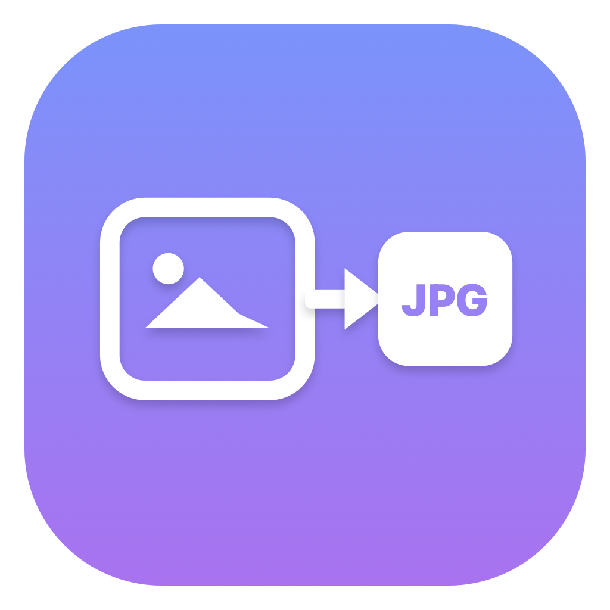
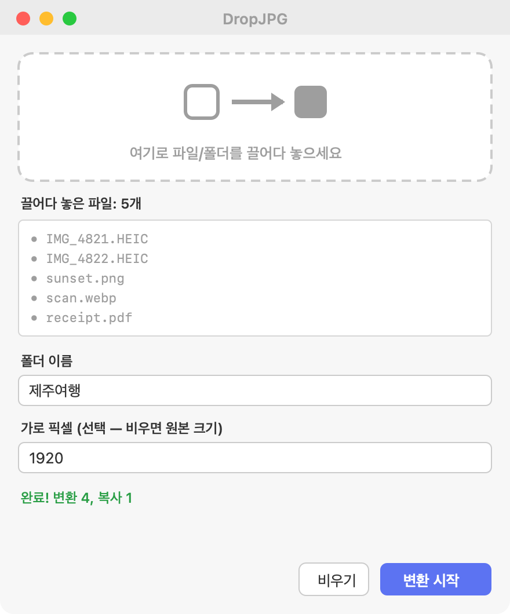

# DropJPG

[](https://github.com/EternaxCode/dropjpg/actions/workflows/release.yml)
[](https://github.com/EternaxCode/dropjpg/releases/latest)

A tiny macOS **menu bar** app that converts images to JPG. Drag photos or
folders onto it, type a name, and every image is converted to
`~/Desktop/<name>/<name>_001.jpg`, `<name>_002.jpg`, … — with optional resizing.

**🌐 Website: [eternaxcode.github.io/dropjpg](https://eternaxcode.github.io/dropjpg/)** · **[⬇ Download latest](https://github.com/EternaxCode/dropjpg/releases/latest/download/DropJPG.dmg)**

> 한국어 안내는 아래 [설치 방법](#설치-방법) 참고.

<p align="center">
  <br><br>
  
</p>

## Features

- 🖼️ **Convert anything to JPG** — JPEG, PNG, GIF, TIFF, WebP, and **HEIC/HEIF**
  (Apple photos) via the built-in `sips` engine. No dependencies.
- 📂 **Drag & drop** files *or* whole folders (recurses into subfolders).
- 🔢 **Auto rename** to `<name>_001.jpg`, `<name>_002.jpg`, …
- 📐 **Optional resize** — set a target width in pixels; aspect ratio is preserved.
- 🗂️ **Output to `~/Desktop/<name>/`** — originals are never touched (copy, not move).
- 📋 Non-image files are copied through with the same numbering.
- 🧭 Lives in the **menu bar** (no Dock icon). Drop window stays on top.

## Install

1. Download `DropJPG.dmg` from the [latest release](../../releases/latest).
2. Open the DMG and drag **DropJPG.app** into **Applications**.
3. **Important — first launch only.** DropJPG is *not* signed with an Apple
   Developer certificate, so macOS Gatekeeper blocks it by default. Remove the
   quarantine flag with **one of these:**

   - **Easy:** double-click **`먼저 실행 - 설치도우미.command`** inside the DMG, or
   - **Terminal:**
     ```bash
     xattr -dr com.apple.quarantine /Applications/DropJPG.app
     ```
4. Launch **DropJPG**. A camera/convert icon appears in the menu bar.

> Why the extra step? An Apple Developer account ($99/yr) is required to sign &
> notarize apps so they open with a normal double-click. This project is free and
> unsigned, so the one-time command above is the trade-off. The command only
> removes the "downloaded from the internet" quarantine attribute — nothing else.

## Usage

1. Click the menu bar icon → **사진 변환…** (Convert).
2. Drag files/folders into the drop zone. Dropped names appear in the list.
3. Type a **folder name** (becomes the Desktop folder + filename prefix).
4. *(Optional)* Type a **target width** in pixels to resize.
5. Click **변환 시작** (Start). The result folder opens in Finder.

## 설치 방법

1. [최신 릴리스](../../releases/latest)에서 `DropJPG.dmg` 다운로드.
2. DMG 열고 **DropJPG.app** 을 **Applications** 로 드래그.
3. **최초 1회만** — 개발자 인증서가 없어 macOS가 실행을 막습니다. 둘 중 하나:
   - DMG 안의 **`먼저 실행 - 설치도우미.command`** 더블클릭, 또는
   - 터미널에 `xattr -dr com.apple.quarantine /Applications/DropJPG.app` 입력.
4. **DropJPG** 실행 → 메뉴바에 아이콘 표시 (Dock에는 안 보임).

## Build from source

Requires Xcode Command Line Tools (`swiftc`). No other dependencies.

```bash
./build.sh        # → DropJPG.app
./make_dmg.sh     # → dist/DropJPG.dmg
```

Icons are generated from `Sources/gen_icons.swift` (CoreGraphics, no design tools).

## Releasing

Releases are automated. Bump the version and push a tag:

```bash
./release.sh 1.1     # bumps VERSION, commits, tags v1.1, pushes
```

The [`Release`](.github/workflows/release.yml) GitHub Actions workflow then builds
the DMG on a macOS runner and publishes a GitHub Release with the asset attached.
The single source of truth for the version is the [`VERSION`](VERSION) file.

## Support / 후원

DropJPG is free and open source. If it saved you some time, you can buy me a coffee ☕

[](https://ko-fi.com/eternaxcode)

> 무료 오픈소스입니다. 유용했다면 커피 한 잔 부탁드려요 → https://ko-fi.com/eternaxcode

## License

MIT — see [LICENSE](LICENSE).
